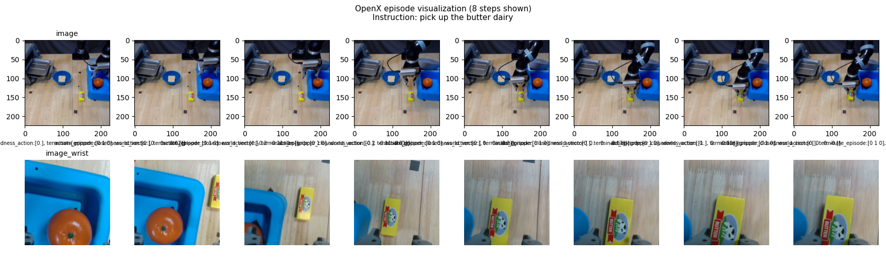
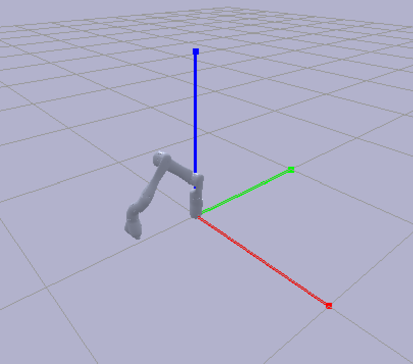
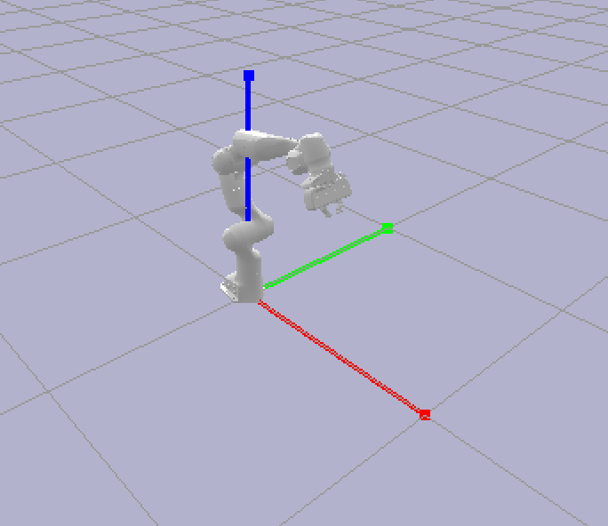

# Installation

conda create -n openx python=3.10

conda activate openx

pip install -r requirements.txt

# Download dataset

Check dataset details here: https://github.com/google-deepmind/open_x_embodiment

Dataset spreadsheet: https://docs.google.com/spreadsheets/d/1rPBD77tk60AEIGZrGSODwyyzs5FgCU9Uz3h-3_t2A9g/edit#gid=0

Example for the jaco_play dataset:
```
gsutil -m rsync -r gs://gresearch/robotics/jaco_play .\tensorflow_datasets\jaco_play
```

# Visualization

1. Visualize an episode
```
python .\visualize_dataset.py --dataset_dir tensorflow_datasets\jaco_play\0.1.0\
```



2. Visualize the robot model
```
python .\vis_urdf_pybullet.py --robot jaco --urdf robots/jaco_description/urdf/jaco_arm.urdf --q -1.8585522 4.022645 1.7151797 -0.3398039 1.0661805 -0.8476771 0.41148704 0.40163106
```


```
python .\vis_urdf_pybullet.py --robot panda --urdf .\robots\franka_description\robots\panda_arm_hand.urdf --q 0.0 -0.5 0.0 -2.0 0.0 2.0 0.8 0.02 0.02
```
